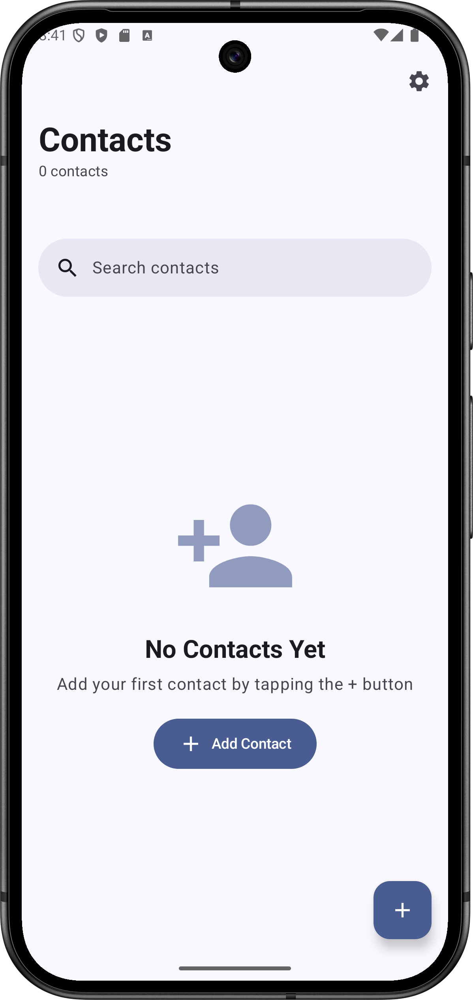
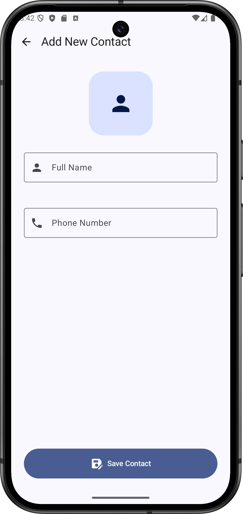
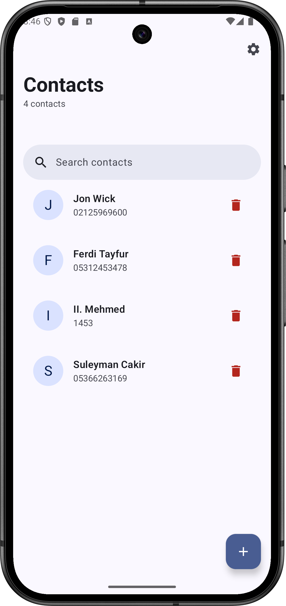
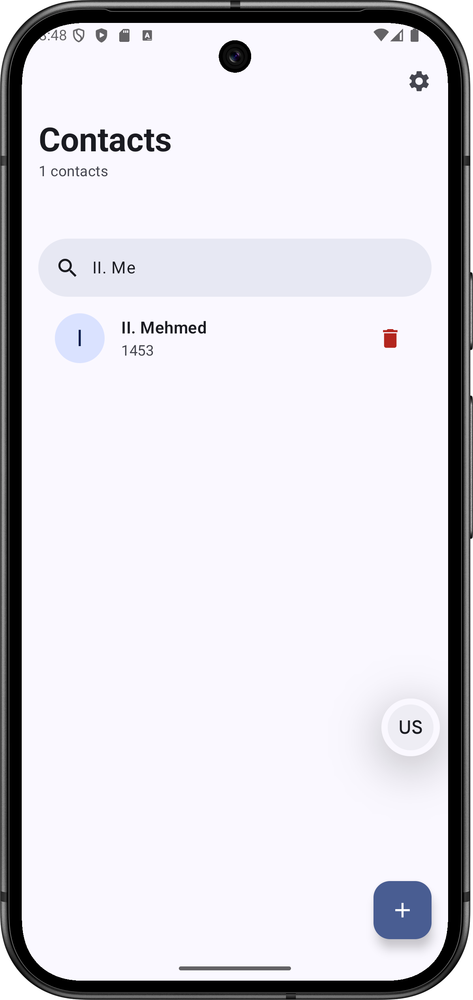

 &nbsp;  &nbsp;  &nbsp; 

# Contacts App

A modern Android contacts management application built with the latest Android development technologies and best practices.

## Technologies
- Kotlin
- Jetpack Compose
- MVVM
- Firebase Firestore
- Material Design 3
- Dagger Hilt for Dependency Injection
- LiveData
- ViewModel
- Jetpack Navigation Component
